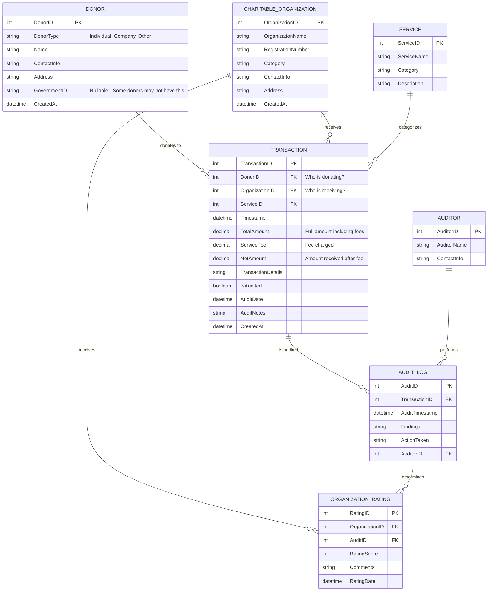
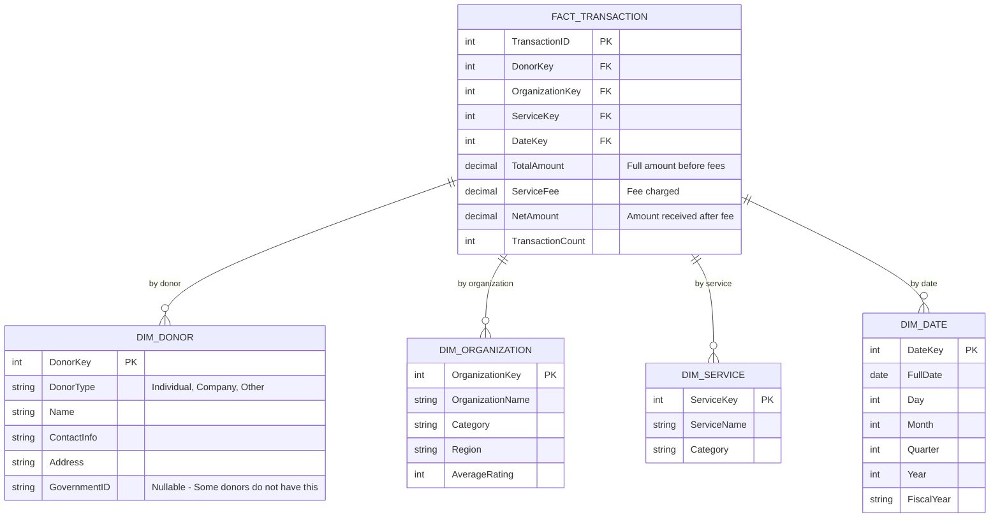
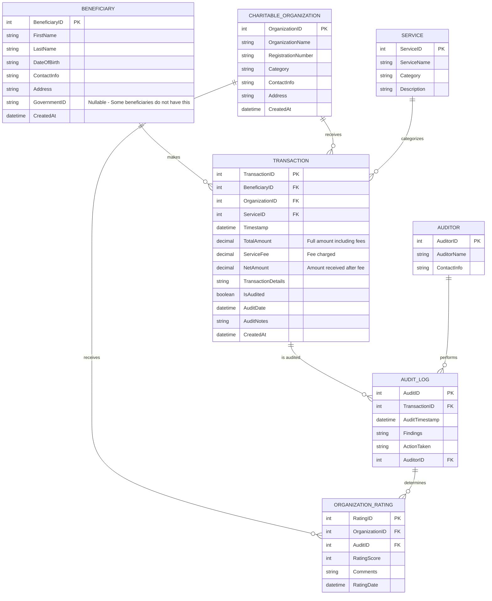
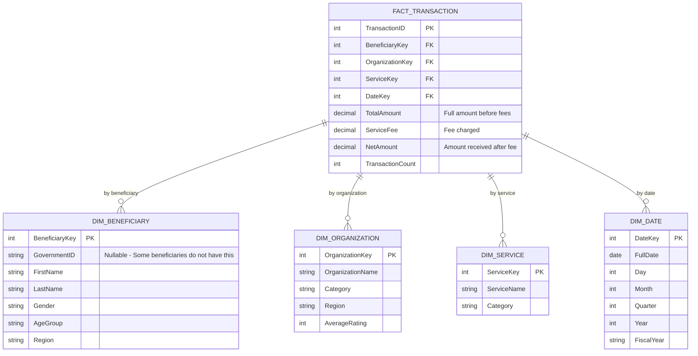

# 📦 One Charity – Data Modeling README

## 📘 Overview
This project presents the **operational (OLTP)** and **analytical (OLAP)** data models for **One Charity**, a fictional centralized platform that coordinates charitable assistance across a city. The system supports transactions between donors (individuals and companies) and charitable organizations, with auditing, service tracking, and organization performance evaluation.

---

## 📊 OLTP Model (Operational)

**Purpose:** Capture day-to-day transactions, donor info, service details, audits, and organization ratings.

### 🔑 Key Entities

- **DONOR**
  - Represents individuals, companies, or other entities donating funds. Nullable `GovernmentID` supports unverified donors.

- **CHARITABLE_ORGANIZATION**
  - The only entities eligible to receive funds or provide services.

- **TRANSACTION**:
  - Records money sent from a Donor to a Charitable Organization, including:
    - `TotalAmount`: Full donation including service fee
    - `ServiceFee`: Fee charged
    - `NetAmount`: Actual amount received by the organization

- **SERVICE**
  - Classifies the purpose of the transaction (e.g., Food Aid, Medical Support).

- **AUDIT_LOG**
  - Tracks audits of individual transactions, including findings and responsible auditor.

- **ORGANIZATION_RATING**
  - Represents performance-based ratings, strictly assigned via audits.

- **AUDITOR**
  - Stores information on the staff or agents who conduct audits.

### ✅ Key Design Choices

- **Nullable Government IDs**
  - Not all donors have official IDs. Surrogate keys will be used to identify donors within the system.

- **Service Fees**
  - Tracked separately from donation amount to calculate net received by organizations.

- **Flexible Donor Types**
  - Supports individuals, companies, and other entities as donors.

- **Performance & Data Integrity**
  - All relationships are normalized to 3.N.F. to ensure maximum write performance and enforce referential integrity (e.g., FK constraints between donors and transactions).

---

## 📈 OLAP Model (Analytics / Data Warehouse)

**Purpose:** Power KPI dashboards, financial reports, and trend analysis using a star schema.

### ⭐ Star Schema Components

- **FactTransaction**
  - Measures donation volume, service fees, net received, and transaction counts.

- **DimDonor**
  - Describes donor attributes (type, name, optional government ID).

- **DimOrganization**
  - Contains static org info + average performance rating.

- **DimService**
  - Classifies services funded by donations.

- **DimDate**
  Ca- lendar dimension for time-based analysis (day, month, year, fiscal period).

### ✅ Key Design Choices

- **Dimensional Modeling**
  - Simplifies complex queries and enables fast, efficient analytics.

- **Denormalized for Performance**
  - Star schema design optimizes read performance for aggregate queries and time-based analysis.

- **Date Dimension**
  - Supports time-based analysis and trend reporting.

### 📊 Key Metrics Supported

- Total donations by donor type (individual, company)
- Net amount received per organization
- Service utilization trends
- Average service fee rates
- Organization performance over time (via ratings)

---

## 🧠 Key Problem Solving Strategies

| Problem                                              | Solution                                                                                                |
| ---------------------------------------------------- | ------------------------------------------------------------------------------------------------------- |
| **Some donors don’t have IDs**                       | `GovernmentID` is nullable; system uses generated `DonorID` as the primary key                          |
| **Need to track service fees**                       | `Transaction` includes `TotalAmount`, `ServiceFee`, and `NetAmount` fields                              |
| **Organizations always receive, donors always give** | `Transaction` separates `DonorID` and `OrganizationID` to clarify direction of funds                    |
| **Unified donor tracking**                           | `DimDonor` in OLAP stores individuals, companies, and other donor types with `DonorType` classification |
| **High-volume analytics**                            | OLAP model is denormalized (star schema) and optimized for time-based and aggregate reporting           |

---

## 🔁 Alternative Design: Beneficiary-Based Model

In some scenarios, One Charity may only need to support **individual donors**, not companies or organizations. In this case, the model can use a **`BENEFICIARY` table instead of `DONOR`**.

### 🔄 Key Differences in This Variant

- **BENEFICIARY** only stores individual people.
- Companies or external entities are **not represented as donors**.
- This approach **simplifies the model** when donations are expected solely from individual users.
- `Transaction.BeneficiaryID` replaces `Transaction.DonorID`.
- There is **no need for a `DonorType`** classification.
- Personal information can be collected for all donors, enabling **more detailed analytics**.

### 📘 Use Case

This alternative is ideal when:

- The system only handles donations from **registered individuals**
- All donations are personal and tied to verified or system-identified users
- Simpler business rules apply to identity and reporting

> ✅ Both `DONOR` and `BENEFICIARY` versions are included in the diagrams for flexibility.

### 📊 OLTP Model (Beneficiary Variant)

### 📈 OLAP Model (Beneficiary Variant)

